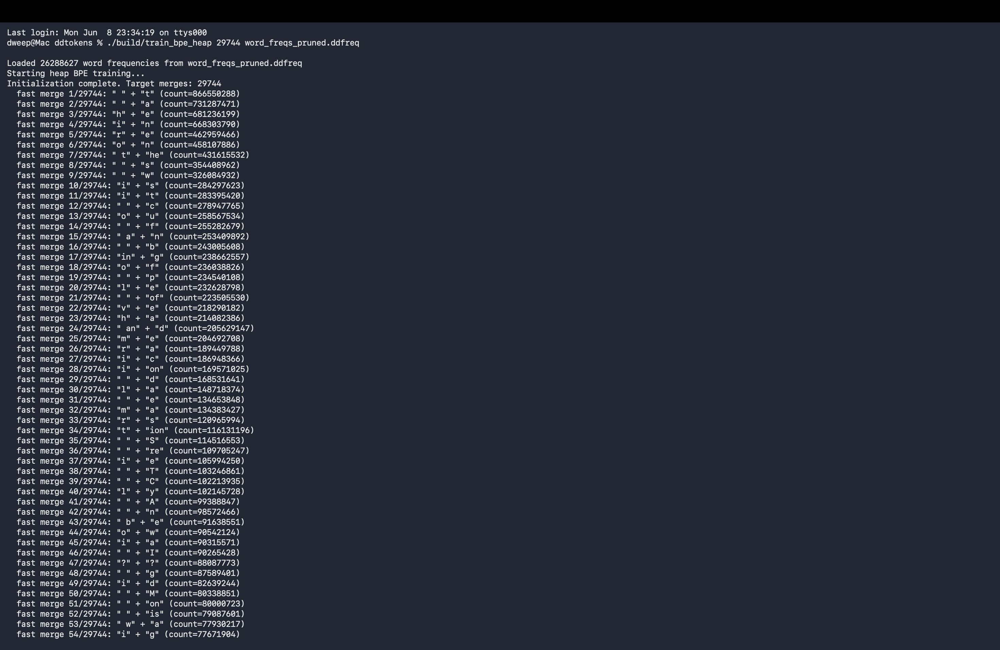
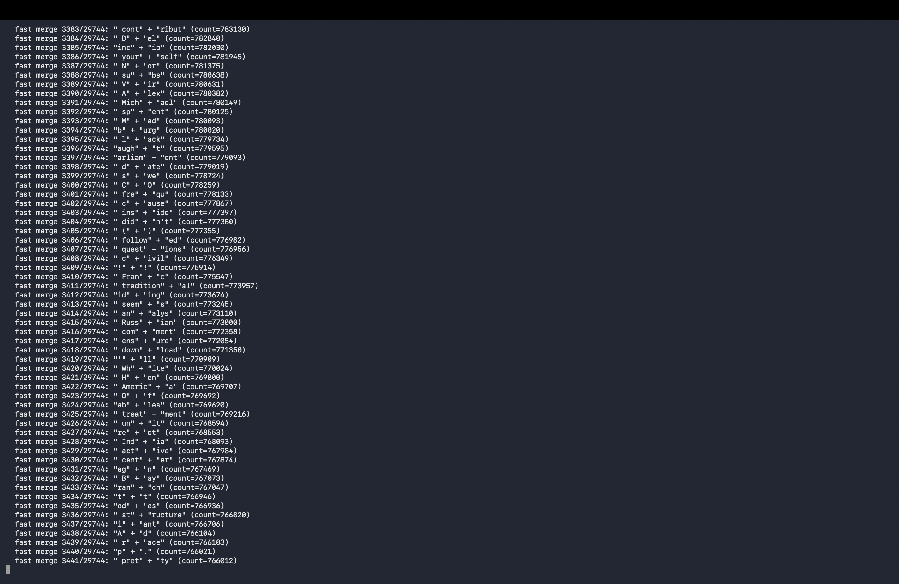

# ddtokens

A custom tokenizer (byte level BPE) trained by me to try to replicate LLAMA 2's massive token vocabulary using an optimised fast heap-based approach (introduced in 2023) to run BPE algorithm training significantly faster (about 100x) than the naive loop-through approach.

(tl;dr: avoid the detailed read if you want—just check out `merges.ddtok` and `vocab.ddtok` to see the generated vocab and merge rules. to see the tokenizer actually working, just run `./build/tokenize_my_text`!)
Watch it live in action and compare with other popular tokenizers at the ddtokens playground - https://dweep-desai.github.io/visual-playground-for-ddtokens/
## Table of Contents
- [Papers](#papers)
- [Datasets](#datasets)
- [Strategy](#strategy)
  - [Data Collection](#data-collection)
  - [Data Cleaning](#data-cleaning)
  - [Dataset Cleaning Strategy](#dataset-cleaning-strategy)
  - [Training Architecture](#training-architecture)
  - [Optimised Approach](#optimised-approach)
    - [Critical Problems Addressed](#critical-problems-addressed)
    - [The "Vanishing Pair" Bug (The Biggest Heap Pitfall)](#the-vanishing-pair-bug-the-biggest-heap-pitfall)
  - [Output](#output)
- [How to Build Your Own Vocabulary](#how-to-build-your-own-vocabulary)

## Papers


* **Neural Machine Translation of Rare Words with Subword Units (2016)** – Introduced BPE to NLP for subword tokenization, enabling models to handle rare and unseen words without a fixed word-level vocabulary.

  * Paper: [https://arxiv.org/abs/1508.07909](https://arxiv.org/abs/1508.07909)

* **Language Models are Unsupervised Multitask Learners (GPT-2, 2019)** – introduced Byte-Level BPE (BBPE), which applies BPE directly to UTF-8 bytes instead of characters. this completely gets rid of "unknown" tokens and makes tokenizing weird text super robust.
  * Paper: [https://cdn.openai.com/better-language-models/language_models_are_unsupervised_multitask_learners.pdf](https://cdn.openai.com/better-language-models/language_models_are_unsupervised_multitask_learners.pdf)

* **Training Multilingual Pre-trained Language Model with Byte-level Subwords (2021)** – Demonstrates the effectiveness of Byte-Level BPE for multilingual language models, showing improved vocabulary sharing across languages while maintaining strong downstream performance.

  * Paper: [https://arxiv.org/abs/2101.09469](https://arxiv.org/abs/2101.09469)

* **A Formal Perspective on Byte-Pair Encoding (2023)** – Rather than treating BPE as a heuristic, the paper formalizes it as a combinatorial optimization problem and derives theoretical guarantees for its behavior. Improves runtime complexity from **O(NM)** to **O(N log M)**, where **N** is sequence length and **M** is the number of merge operations.

  * Paper: [https://arxiv.org/pdf/2306.16837](https://arxiv.org/pdf/2306.16837)

## Datasets

- wikipedia - https://dumps.wikimedia.org/enwiki/latest/
- stack overflow - https://archive.org/download/stackexchange (i actually didn't end up using this because of RAM limits. while building the hashmap, it hit 25gb of RAM on my 16gb machine, and my laptop started heavily relying on swap files, making it exponentially slower).
- fineweb - https://huggingface.co/datasets/HuggingFaceFW/fineweb (sample-10BT)

**Uncompressed and uncleaned data:**
- wikipedia: 115 GB
- fineweb-sample-10BT: 43 GB

**Cleaned data:**
- wikipedia: 18 GB
- fineweb: 42.75 GB

## Strategy

### Data Collection

i'm training on three diverse, large-scale text corpora to build a really solid general-purpose vocabulary:
- **Stack Overflow** (~104 GB XML dump) — covers programming languages, technical jargon, code snippets, and dev Q&A. (like i mentioned, it's great for the dataset, but i couldn't use it in the final training due to my computer's physical limits).
- **English Wikipedia** (~116 GB XML dump) — covers formal prose, scientific terms, historical text, and multilingual proper nouns.
- **FineWeb sample-10BT** (a 43 GB sample of 10 billion tokens from the massive 800 GB dataset) — covers general web text, informal writing, and conversational language.

### Data Cleaning

raw dumps are full of XML tags, HTML entities, and MediaWiki markup that would totally pollute the vocabulary. each dataset goes through a dedicated cleaning pipeline (just some Python scripts using streaming XML parsers) that strips all the junk out and leaves plain UTF-8 text files. we only want actual human-written content.

### Dataset Cleaning Strategy

to stop unique word inflation and hashmap memory bloat (which can easily crash your RAM on raw web data), the text goes through some aggressive filtering before we even build frequencies:
- **Leading special characters:** all punctuation, bullets, dashes, or symbols at the start of a line get stripped.
- **Junk sequences:** hex blobs, base64 data, URLs, and emails are entirely tossed out.
- **Repeating characters:** if someone spams a character 4 or more times (like a super long dash), it gets collapsed down to exactly 3 repetitions and padded with spaces so it doesn't merge into surrounding words.
- **Pipe limits:** files with crazy amounts of pipe characters (like broken markdown tables) get all but the first two pipes replaced with spaces. this keeps the pipe token alive without creating massive concatenated string nightmares.
- **Normalization:** weird Unicode whitespace is normalized to standard ASCII spaces, and multiple spaces are collapsed into one.
- **Frequency Pruning:** after building the initial word frequency hashmap, words that appear exactly once across the whole corpus are aggressively pruned. this wipes out millions of garbage entries (typos, unique hashes, parsing errors) from the long tail of Zipf's law. it freed up over 10GB of RAM for the BPE merge loops without hurting tokenization quality at all.

### Training Architecture

the tokenizer is trained using a two-phase approach so it can handle 200+ GB of text on a single machine without needing to load everything into memory at once:

**Phase 1 — Word Frequency Extraction (Single Pass):**
each cleaned text file is streamed line-by-line through the C++ engine exactly once. the engine splits text on whitespace boundaries (but keeps the leading spaces attached to the word, which is exactly how GPT-2 and tiktoken do it) and builds up a massive global hashmap of `word → frequency`. once this is done, you can literally delete the original text files.

**Phase 2 — BPE Merge Loop (In-Memory):**
every unique word in the hashmap gets broken down into its individual bytes (the 256 base tokens). then, the algorithm goes into a loop:
1. counts all adjacent token pairs across every word, weighted by how often that word appeared in the corpus.
2. finds the single most frequent pair.
3. merges that pair into a brand new token everywhere it appears.
4. records the merge rule.

this repeats for whatever target number of merges you want (29,744 merges + 256 base bytes = 30,000 total vocab size). since my project is just for English general text, 30k is a pretty sweet spot balancing compression and compute cost (Meta's LLaMA 2 uses a 32k vocab). the cool insight here is that human language is crazy repetitive—billions of tokens compress down to just millions of unique words, which easily fits in RAM.

### Optimised Approach

i initially tried training the BPE merges with a naive approach where the CPU recalculates the frequencies of all adjacent byte pairs by scanning every word in the vocabulary on every single merge step. with millions of unique words and 30,000 merges to go, i quickly realized this was going to take literally days (like, over 4 trillion operations!). 

so, i rewrote it using this new optimized approach with a Priority Queue (Max-Heap) and a Reverse Index.

**How it works:**
instead of scanning all the words every time, the algorithm counts pairs exactly once at the very beginning and throws them into a Max-Heap so we can instantly grab the most frequent pair. a Reverse Index keeps track of exactly which words contain which byte pairs. when a merge happens, the algorithm only updates the specific words flagged by the Reverse Index. this drops the time complexity from days down to a few minutes (under 1 billion operations).

**Example in a tiny 15-word space:**
imagine a mini dataset of 15 words where 5 are `c a b`, 3 are `d a b`, and 7 are `c a d`. 
1. **Initial Scan:** the pair `(a, b)` shows up 8 times. `(c, a)` shows up 12 times. the Reverse Index remembers who has what.
2. **The Merge:** the heap pops out the top pair: `(c, a)`. 
3. **The Update:** the Reverse Index points us directly to the 12 words containing `(c, a)`. we merge `(c, a)` into `ca` for just those words. 
4. **Delta Math:** since `a` isn't standing alone anymore, overlapping pairs like `(a, b)` and `(a, d)` lose frequency, and new pairs like `(ca, b)` and `(ca, d)` are added to the heap. those other 3 words (`d a b`) are completely ignored, saving a ton of compute time!

#### Critical Problems Addressed
building this $O(N \log N)$ heap approach was tricky and introduced a bunch of edge cases that this codebase fixes:
- **Stale Entries in the Heap:** you can't efficiently delete pairs from the middle of a heap when their frequencies drop. so, the code uses **Lazy Deletion**. when a pair is popped, we double-check its frequency against a ground-truth `current_pair_counts` hashmap. if they don't match, we just toss it out as stale.
- **Word Frequency Weighting:** pair counts aren't just incremented by `1`. they are strictly weighted by the parent word's frequency in the massive corpus (`pair_count += word_freq`).
- **Neighbor Pair Delta Math:** when merging `A` and `B` into `AB`, the left and right neighbor boundaries have to update. `(X, A)` and `(B, Y)` go down, while `(X, AB)` and `(AB, Y)` go up and get pushed to the heap.
- **Word Representation:** words aren't stored as strings (because string splits are too slow). they are stored as a `std::vector<std::string>` to allow super fast $O(L)$ array rebuilds when tokens merge.
- **End-of-Word Tokens:** instead of sticking fake `</w>` tokens onto the ends of words, this strictly follows the GPT-2/tiktoken byte-level standard. whitespace is preserved as a leading byte (`" hello"` vs `"hello"`), acting as a natural boundary.
- **O(N) Heap Initialization:** the first Max-Heap is built by passing an entire `std::vector` of pairs straight to the `std::priority_queue` constructor. under the hood, this uses `std::make_heap` to build the structure in pure $O(N)$ linear time, which is more than 2x faster than inserting elements one-by-one.

#### The "Vanishing Pair" Bug (The Biggest Heap Pitfall)
when i implemented Lazy Deletion, i ran into a massive logical trap that completely broke the math of the algorithm at first.

**What it was doing:**
when a pair merges (like merging `h` and `e`), it naturally destroys overlapping pairs (like `e` and `r` in the word `h e r e`). because `(e, r)` is destroyed, its true frequency mathematically drops. 
the algorithm correctly noticed that the old, higher frequency for `(e, r)` in the priority queue was now "stale". when that stale entry finally reached the top of the heap, the Lazy Deletion check successfully threw it in the trash. but here's the catch—the algorithm **failed to push the new, lower frequency back into the priority queue.** 
as a result, the pair `(e, r)` completely vanished from the heap and was lost forever, which totally screwed up the frequencies and merge choices later on.

**What it should do (The Fix):**
every single time a neighbor pair's frequency drops because of an overlap destruction, that new lower frequency **must** be explicitly pushed right back into the heap.

**Example:**
imagine the pair `(e, r)` has a massive frequency of 485 million.
1. we merge `(h, e)` into `he`.
2. in words like `h e r e`, the `e` gets eaten, destroying the `(e, r)` pair.
3. we drop the true count of `(e, r)` down to 460 million.
4. the heap still has the old `(485M, (e, r))` entry sitting in it.
5. **The Fix:** we immediately shove `(460M, (e, r))` into the heap.
6. later, the heap pops the 485M entry. Lazy Deletion sees that 485M != 460M, and trashes the 485M entry.
7. eventually, the heap pops the 460M entry. Lazy Deletion sees that 460M == 460M, and successfully merges it!

### Training Screenshots

Here are screenshots of the BPE training process using the optimized heap-based implementation:





### Output

the trained tokenizer spits out two files:
- **`merges.ddtok`** — the ordered list of merge rules (the sequence is super important for deterministic tokenization).
- **`vocab.ddtok`** — the complete token-to-ID mapping (the 256 base bytes + all the merged tokens).

these files define the entire tokenizer. you can load them up to encode any random text into token IDs.

## How to Build Your Own Vocabulary

want to train your own BPE tokenizer from scratch? here is the exact sequence of commands to get it running:

1. **Clone the repo and compile everything:**
   ```bash
   git clone https://github.com/dweep-desai/ddtokens.git
   cd ddtokens
   mkdir build && cd build
   cmake .. && make
   cd ..
   ```

2. **Clean your datasets:**
   (use the Python scripts in the `scripts/` directory to strip out XML, HTML, and markdown junk from your raw text dumps. this will give you plain UTF-8 text files ready for the engine).

3. **Build the frequency hashmap:**
   (stream your cleaned text files to extract unique words and their frequencies. this creates a super compressed `.ddfreq` binary file so we don't blow up our RAM later).
   ```bash
   ./build/build_freqs < /path/to/your_cleaned_dataset.txt
   ```

4. **Train the BPE Merges (Choose a path):**
   
   **Path A: The Naive Approach**
   (this uses the standard iterative search method. it's simple but will literally take days for large vocabularies - definitely avoid this unless you are just testing or working with tiny datasets).
   ```bash
   ./build/train_bpe
   ```

   **Path B: The Optimised Heap Approach**
   (this uses the priority queue (Max-Heap) and reverse index, making training about 100x faster! highly recommended if you actually want this to finish).
   ```bash
   ./build/train_bpe_heap
   ```

   (both of these paths will read the hashmap and generate your shiny new `merges.ddtok` and `vocab.ddtok` files).

5. **Test your new tokenizer:**
   (run the interactive tool to see your newly learned BPE rules in action on any text you type in the terminal! it loads up your generated `merges.ddtok` and `vocab.ddtok` files automatically).
   ```bash
   ./build/tokenize_my_text
   ```

*NOTE* - this is just my current strategy, and it might change as i keep working on the codebase!
